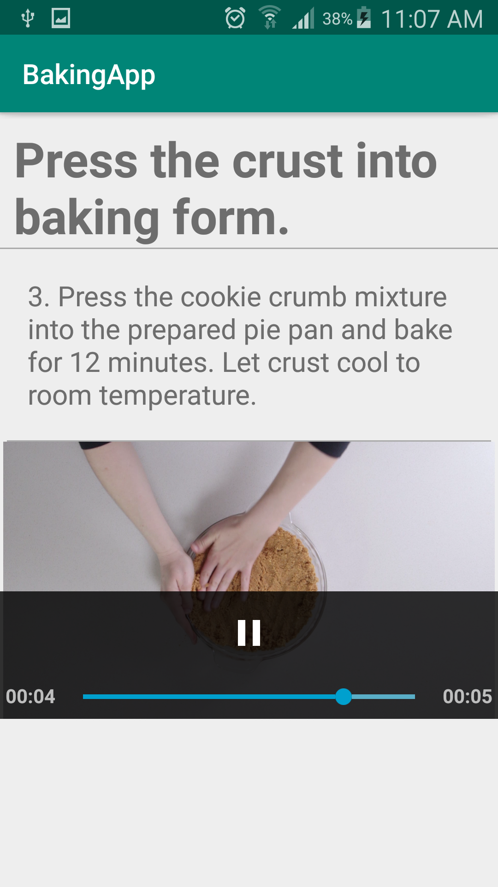
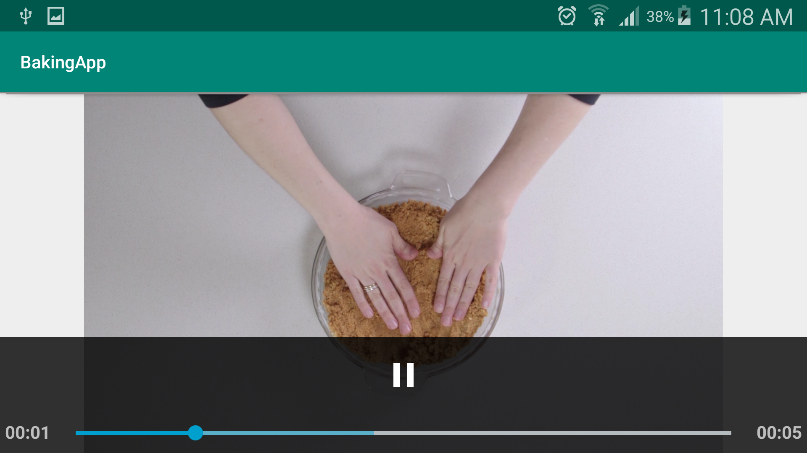

# Food Recipes App
The app was developed using the Java Programming language. The app shows 4 different recipes with all the steps. 
Some steps include a video to show how to do the step correctly. The main purpose of the app is to learn who to use different types of media in android development. 
Exoplayer was used to display the videos; Exoplayer allows the developer to develop his own controller for the video. 
So the developer could add a forward button, backward button, stop button, next button, and etc.
 Also, the Retrofit library was used to do the HTTP request to get the JSON file; 
Retrofit makes the HTTP request extremely easy so instead of writing the code to build the URI, and the URL retrofit done it in a simple and fast way.

## Screenshots
### Exoplayer (portrait)

### Exoplayer (landscape)

